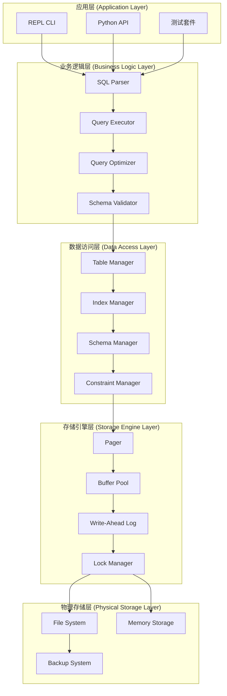

# PySQLit 架构设计文档

## 🎯 架构概览

PySQLit采用**分层架构模式**，结合**领域驱动设计(DDD)**和**面向对象设计原则**，构建了一个高度可扩展、可维护的数据库引擎。架构设计遵循**SOLID原则**，使用**设计模式**解决复杂问题，确保代码质量和系统稳定性。

## 🏗️ 系统架构图



## 🏛️ 分层架构详解

### 1. 应用层 (Application Layer)

#### 1.1 REPL CLI
- **职责**: 提供交互式命令行界面
- **设计模式**: 命令模式(Command Pattern)
- **关键类**: `EnhancedREPL`, `InputBuffer`, `MetaCommand`

```python
class EnhancedREPL:
    """交互式命令行界面"""
    
    def __init__(self, database_file: str):
        self.db = EnhancedDatabase(database_file)
        self.command_handlers = {
            '.help': self.handle_help,
            '.tables': self.handle_tables,
            '.schema': self.handle_schema,
            '.backup': self.handle_backup,
        }
```

#### 1.2 Python API
- **职责**: 提供编程接口
- **设计模式**: 外观模式(Facade Pattern)
- **关键类**: `EnhancedDatabase`, `EnhancedTable`

### 2. 业务逻辑层 (Business Logic Layer)

#### 2.1 SQL解析器 (SQL Parser)
- **职责**: 解析SQL语句为抽象语法树(AST)
- **设计模式**: 解释器模式(Interpreter Pattern)
- **关键类**: `EnhancedSQLParser`, `Statement`

```python
class EnhancedSQLParser:
    """SQL语句解析器"""
    
    @staticmethod
    def parse_statement(sql: str) -> Tuple[PrepareResult, Optional[Statement]]:
        """将SQL字符串解析为语句对象"""
        # 实现LL(1)解析算法
```

#### 2.2 查询执行器 (Query Executor)
- **职责**: 执行解析后的SQL语句
- **设计模式**: 策略模式(Strategy Pattern)
- **关键类**: `QueryExecutor`, `ExecutionContext`

#### 2.3 查询优化器 (Query Optimizer)
- **职责**: 优化查询计划，提高执行效率
- **设计模式**: 策略模式(Strategy Pattern)
- **关键类**: `QueryOptimizer`, `QueryPlan`

### 3. 数据访问层 (Data Access Layer)

#### 3.1 表管理器 (Table Manager)
- **职责**: 管理表结构和数据操作
- **设计模式**: 模板方法模式(Template Method Pattern)
- **关键类**: `EnhancedTable`, `TableSchema`

```python
class EnhancedTable:
    """表管理器"""
    
    def __init__(self, pager: ConcurrentPager, table_name: str, schema: TableSchema):
        self.pager = pager
        self.name = table_name
        self.schema = schema
        self.indexes = {}
```

#### 3.2 索引管理器 (Index Manager)
- **职责**: 管理B树索引
- **设计模式**: 组合模式(Composite Pattern)
- **关键类**: `EnhancedBTree`, `BTreeNode`

#### 3.3 约束管理器 (Constraint Manager)
- **职责**: 管理数据完整性约束
- **设计模式**: 责任链模式(Chain of Responsibility)
- **关键类**: `ConstraintValidator`, `ForeignKeyChecker`

### 4. 存储引擎层 (Storage Engine Layer)

#### 4.1 页管理器 (Pager)
- **职责**: 管理磁盘页的读写
- **设计模式**: 单例模式(Singleton Pattern)
- **关键类**: `ConcurrentPager`, `Page`

#### 4.2 缓冲池 (Buffer Pool)
- **职责**: 缓存热点数据页，减少磁盘I/O
- **设计模式**: 享元模式(Flyweight Pattern)
- **关键类**: `BufferPool`, `PageCache`

#### 4.3 预写日志 (Write-Ahead Log)
- **职责**: 保证事务的持久性
- **设计模式**: 观察者模式(Observer Pattern)
- **关键类**: `WALManager`, `LogRecord`

#### 4.4 锁管理器 (Lock Manager)
- **职责**: 管理并发访问的锁机制
- **设计模式**: 状态模式(State Pattern)
- **关键类**: `LockManager`, `LockTable`

## 🎯 设计模式应用

### 1. 创建型模式

#### 1.1 工厂模式 (Factory Pattern)
```python
class DatabaseFactory:
    """数据库工厂类"""
    
    @staticmethod
    def create_database(filename: str) -> EnhancedDatabase:
        """创建数据库实例"""
        if filename == ":memory:":
            return InMemoryDatabase()
        else:
            return FileDatabase(filename)
```

#### 1.2 建造者模式 (Builder Pattern)
```python
class TableSchemaBuilder:
    """表模式建造者"""
    
    def __init__(self, table_name: str):
        self.schema = TableSchema(table_name)
    
    def add_column(self, name: str, data_type: DataType) -> 'TableSchemaBuilder':
        self.schema.add_column(ColumnDefinition(name, data_type))
        return self
    
    def build(self) -> TableSchema:
        return self.schema
```

### 2. 结构型模式

#### 2.1 适配器模式 (Adapter Pattern)
```python
class StorageAdapter(StorageInterface):
    """存储适配器"""
    
    def __init__(self, storage: Any):
        self.storage = storage
    
    def read_page(self, page_num: int) -> bytearray:
        return self.storage.read(page_num)
```

#### 2.2 装饰器模式 (Decorator Pattern)
```python
class LoggingStorage(StorageInterface):
    """带日志功能的存储装饰器"""
    
    def __init__(self, storage: StorageInterface):
        self.storage = storage
    
    def read_page(self, page_num: int) -> bytearray:
        logger.debug(f"Reading page {page_num}")
        return self.storage.read_page(page_num)
```

### 3. 行为型模式

#### 3.1 策略模式 (Strategy Pattern)
```python
class IndexStrategy(ABC):
    """索引策略接口"""
    
    @abstractmethod
    def create_index(self) -> IndexInterface:
        pass

class BTreeStrategy(IndexStrategy):
    """B树索引策略"""
    
    def create_index(self) -> IndexInterface:
        return EnhancedBTree()

class HashStrategy(IndexStrategy):
    """哈希索引策略"""
    
    def create_index(self) -> IndexInterface:
        return HashIndex()
```

#### 3.2 观察者模式 (Observer Pattern)
```python
class DatabaseObserver(ABC):
    """数据库观察者接口"""
    
    @abstractmethod
    def on_table_created(self, table_name: str):
        pass
    
    @abstractmethod
    def on_data_changed(self, table_name: str, operation: str):
        pass

class MetricsCollector(DatabaseObserver):
    """指标收集器"""
    
    def on_table_created(self, table_name: str):
        self.metrics.increment_table_count()
```

## 🔧 核心组件设计

### 1. 存储引擎设计

#### 1.1 页结构
```python
class Page:
    """数据库页"""
    
    PAGE_SIZE = 4096
    PAGE_HEADER_SIZE = 8
    
    def __init__(self, page_num: int):
        self.page_num = page_num
        self.data = bytearray(PAGE_SIZE)
        self.is_dirty = False
        self.pin_count = 0
```

#### 1.2 空闲空间管理
```python
class FreeSpaceManager:
    """空闲空间管理器"""
    
    def __init__(self):
        self.free_list = []
        self.bitmap = {}
    
    def allocate_page(self) -> int:
        """分配空闲页"""
        if self.free_list:
            return self.free_list.pop()
        return self.extend_file()
    
    def free_page(self, page_num: int):
        """释放页"""
        self.free_list.append(page_num)
```

### 2. 索引设计

#### 2.1 B树结构
```python
class BTreeNode:
    """B树节点"""
    
    def __init__(self, page: Page, is_leaf: bool = False):
        self.page = page
        self.is_leaf = is_leaf
        self.keys = []
        self.values = []
        self.children = []
```

#### 2.2 索引优化
```python
class IndexStatistics:
    """索引统计信息"""
    
    def __init__(self):
        self.cardinality = 0
        self.selectivity = 0.0
        self.last_updated = datetime.now()
```

### 3. 事务设计

#### 3.1 事务状态机
```python
class TransactionState(Enum):
    """事务状态"""
    ACTIVE = "active"
    COMMITTED = "committed"
    ABORTED = "aborted"
    PREPARING = "preparing"

class Transaction:
    """事务对象"""
    
    def __init__(self, tx_id: int):
        self.tx_id = tx_id
        self.state = TransactionState.ACTIVE
        self.read_set = set()
        self.write_set = set()
        self.undo_log = []
```

#### 3.2 并发控制
```python
class LockManager:
    """锁管理器"""
    
    def __init__(self):
        self.lock_table = {}
        self.wait_for_graph = {}
    
    def acquire_lock(self, tx_id: int, resource: str, lock_type: LockType) -> bool:
        """获取锁，支持死锁检测"""
        if self.detect_deadlock(tx_id, resource):
            raise DeadlockException()
        # 实现锁获取逻辑
```

## 🚀 扩展性设计

### 1. 插件系统
```python
class PluginManager:
    """插件管理器"""
    
    def __init__(self):
        self.plugins = {}
    
    def register_plugin(self, name: str, plugin: DatabasePlugin):
        """注册插件"""
        self.plugins[name] = plugin
    
    def execute_hook(self, hook_name: str, *args, **kwargs):
        """执行钩子函数"""
        for plugin in self.plugins.values():
            if hasattr(plugin, hook_name):
                getattr(plugin, hook_name)(*args, **kwargs)
```

### 2. 存储引擎扩展
```python
class StorageEngine(ABC):
    """存储引擎接口"""
    
    @abstractmethod
    def create_table(self, table_name: str, schema: TableSchema):
        pass
    
    @abstractmethod
    def drop_table(self, table_name: str):
        pass

class MemoryStorageEngine(StorageEngine):
    """内存存储引擎"""
    pass

class FileStorageEngine(StorageEngine):
    """文件存储引擎"""
    pass
```

### 3. 索引类型扩展
```python
class IndexType(Enum):
    """索引类型枚举"""
    BTREE = "btree"
    HASH = "hash"
    FULLTEXT = "fulltext"
    SPATIAL = "spatial"

class IndexFactory:
    """索引工厂"""
    
    @staticmethod
    def create_index(index_type: IndexType) -> IndexInterface:
        """根据类型创建索引"""
        index_map = {
            IndexType.BTREE: BTreeIndex,
            IndexType.HASH: HashIndex,
            IndexType.FULLTEXT: FullTextIndex,
            IndexType.SPATIAL: SpatialIndex,
        }
        return index_map[index_type]()
```

## 📊 性能架构

### 1. 缓存策略
```python
class LRUCache:
    """LRU缓存实现"""
    
    def __init__(self, capacity: int):
        self.capacity = capacity
        self.cache = OrderedDict()
    
    def get(self, key: str) -> Any:
        if key in self.cache:
            self.cache.move_to_end(key)
            return self.cache[key]
        return None
    
    def put(self, key: str, value: Any):
        if key in self.cache:
            self.cache.move_to_end(key)
        else:
            if len(self.cache) >= self.capacity:
                self.cache.popitem(last=False)
            self.cache[key] = value
```

### 2. 连接池
```python
class ConnectionPool:
    """数据库连接池"""
    
    def __init__(self, max_connections: int = 10):
        self.max_connections = max_connections
        self.pool = queue.Queue(max_connections)
        self.active_connections = 0
    
    def get_connection(self) -> EnhancedDatabase:
        """获取数据库连接"""
        if not self.pool.empty():
            return self.pool.get()
        
        if self.active_connections < self.max_connections:
            connection = EnhancedDatabase(":memory:")
            self.active_connections += 1
            return connection
        
        raise ConnectionPoolException("No available connections")
```

## 🔍 监控与诊断

### 1. 性能监控
```python
class PerformanceMonitor:
    """性能监控器"""
    
    def __init__(self):
        self.metrics = {
            'query_count': 0,
            'query_time': 0.0,
            'cache_hit_rate': 0.0,
            'lock_wait_time': 0.0,
        }
    
    def record_query(self, sql: str, duration: float):
        """记录查询性能"""
        self.metrics['query_count'] += 1
        self.metrics['query_time'] += duration
    
    def get_report(self) -> Dict[str, float]:
        """获取性能报告"""
        return self.metrics.copy()
```

### 2. 慢查询日志
```python
class SlowQueryLogger:
    """慢查询日志"""
    
    def __init__(self, threshold_ms: int = 100):
        self.threshold = threshold_ms
        self.slow_queries = []
    
    def log_query(self, sql: str, duration_ms: float, params: tuple):
        """记录慢查询"""
        if duration_ms > self.threshold:
            self.slow_queries.append({
                'sql': sql,
                'duration': duration_ms,
                'params': params,
                'timestamp': datetime.now()
            })
```

## 🛡️ 安全架构

### 1. 访问控制
```python
class AccessControl:
    """访问控制"""
    
    def __init__(self):
        self.permissions = {}
        self.roles = {}
    
    def grant_permission(self, user: str, resource: str, action: str):
        """授予权限"""
        key = (user, resource)
        if key not in self.permissions:
            self.permissions[key] = set()
        self.permissions[key].add(action)
    
    def check_permission(self, user: str, resource: str, action: str) -> bool:
        """检查权限"""
        key = (user, resource)
        return action in self.permissions.get(key, set())
```

### 2. 数据加密
```python
class EncryptionManager:
    """数据加密管理器"""
    
    def __init__(self, key: bytes):
        self.key = key
        self.cipher = Fernet(key)
    
    def encrypt_page(self, page_data: bytes) -> bytes:
        """加密页数据"""
        return self.cipher.encrypt(page_data)
    
    def decrypt_page(self, encrypted_data: bytes) -> bytes:
        """解密页数据"""
        return self.cipher.decrypt(encrypted_data)
```

## 🔄 高可用设计

### 1. 主从复制
```python
class ReplicationManager:
    """复制管理器"""
    
    def __init__(self):
        self.master = None
        self.slaves = []
        self.log_sequence_number = 0
    
    def add_slave(self, slave: EnhancedDatabase):
        """添加从库"""
        self.slaves.append(slave)
    
    def replicate_log(self, log_record: LogRecord):
        """复制日志到从库"""
        for slave in self.slaves:
            slave.apply_log_record(log_record)
```

### 2. 故障转移
```python
class FailoverManager:
    """故障转移管理器"""
    
    def __init__(self):
        self.health_checker = HealthChecker()
        self.failover_strategy = PromoteSlaveStrategy()
    
    def handle_failure(self, failed_node: str):
        """处理节点故障"""
        if self.health_checker.is_failed(failed_node):
            self.failover_strategy.execute(failed_node)
```

## 📈 未来架构演进

### 阶段1: 分布式架构
- 支持多节点部署
- 数据分片
- 分布式事务

### 阶段2: 云原生
- Kubernetes部署
- 自动扩缩容
- 服务网格集成

### 阶段3: AI优化
- 查询优化器ML化
- 自动调优
- 异常检测

---

**架构设计原则**: 简单性、可扩展性、可维护性、高性能